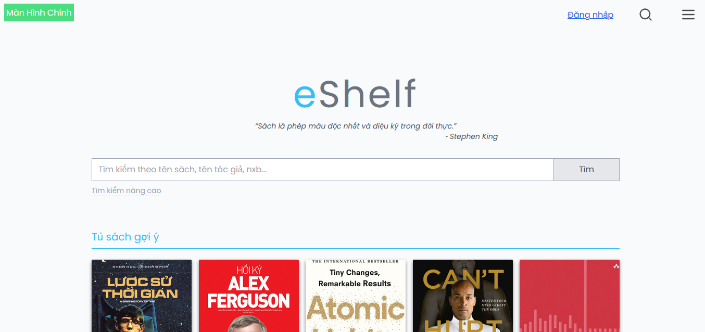
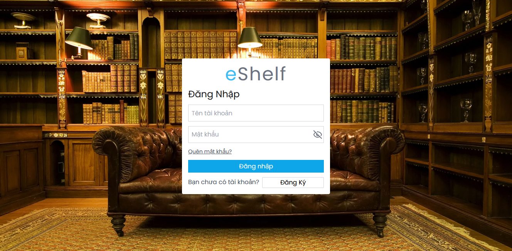
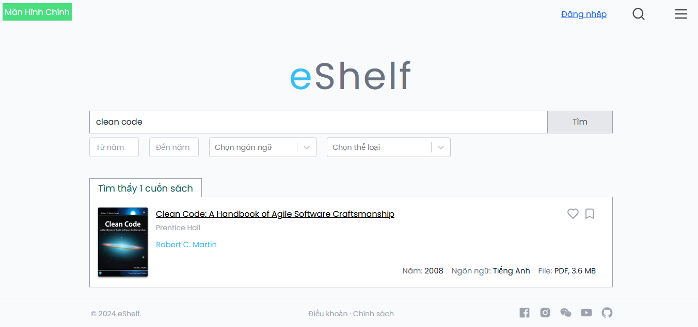
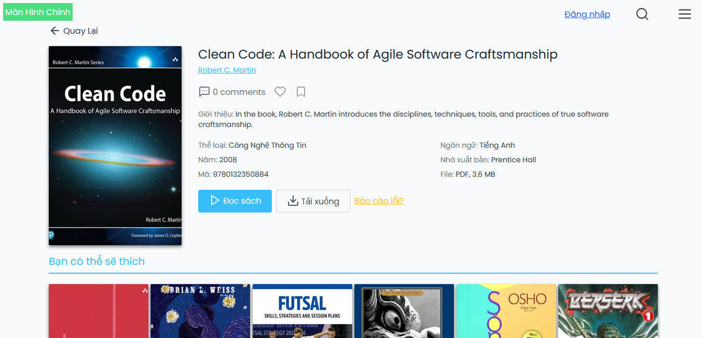
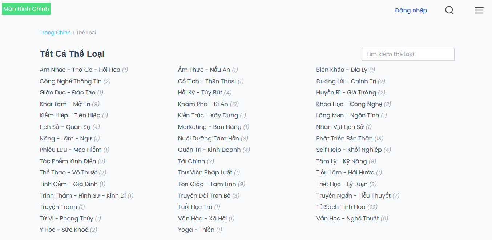
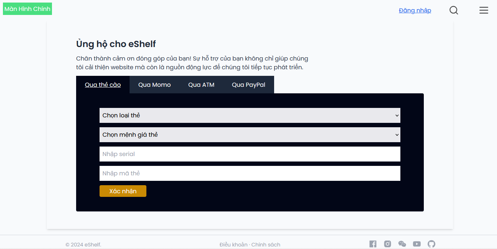
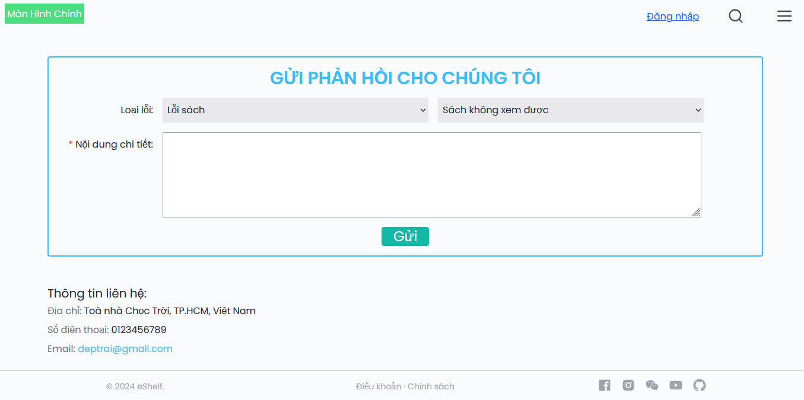

# eShelf - Enterprise eBook Platform

[](https://github.com/levanvux/eShelf/actions)
[](https://www.terraform.io/)
[](https://kubernetes.io/)
[](https://opensource.org/licenses/MIT)

> **Đồ án môn học IE104 - UIT**  
> Website đọc sách eBooks với kiến trúc microservices, CI/CD pipeline và MLOps.

---

## 📋 Mục lục

- [Thành viên](#-thành-viên)
- [Tiến độ dự án](#-tiến-độ-dự-án)
- [Cấu trúc thư mục](#-cấu-trúc-thư-mục-hiện-tại)
- [Chức năng đã hoàn thành](#-chức-năng-đã-hoàn-thành)
- [Kế hoạch phát triển](#-kế-hoạch-phát-triển)
- [Kiến trúc hệ thống](#-kiến-trúc-hệ-thống)
- [Lab 1: Infrastructure as Code](#-lab-1-infrastructure-as-code)
- [Lab 2: CI/CD Automation](#-lab-2-cicd-automation)
- [Hướng dẫn chạy dự án](#-hướng-dẫn-chạy-dự-án)
- [Demo Screenshots](#-demo-screenshots)

---

## 👥 Thành viên

| MSSV | Họ Tên | Vai trò |
|------|--------|---------|
| 23521809 | Lê Văn Vũ | Full-stack / DevOps / MLOps Engineer |

---

## 📊 Tiến độ dự án

| Phase | Mô tả | Trạng thái | Chi tiết |
|-------|-------|------------|----------|
| **Phase 1** | Frontend Enhancement | ✅ **Hoàn thành** | Prompt 1.1-1.6 |
| **Phase 2** | Backend Services | 🔄 **Đang làm** | Prompt 2.1 ✅ |
| **Phase 3** | Database | 📋 Chờ | Prompt 3.1-3.3 |
| **Phase 4** | AI/ML Features | 📋 Chờ | Prompt 4.1-4.6 |
| **Phase 5** | DevOps Lab 1 | 📋 Chờ | Prompt 5.1-5.10 |
| **Phase 6** | DevOps Lab 2 | 📋 Chờ | Prompt 6.1-6.9 |
| **Phase 7** | Kubernetes | 📋 Chờ | Prompt 7.1-7.8 |
| **Phase 8** | Monitoring | 📋 Chờ | Prompt 8.1-8.6 |
| **Phase 9** | MLOps | 📋 Chờ | Prompt 9.1-9.6 |

---

## 📁 Cấu trúc thư mục hiện tại

```
eShelf/
├── public/
│   ├── demo/                          # Screenshots demo
│   ├── pdfs/                          # File PDF sách mẫu
│   └── images/
│       ├── book-covers/               # Ảnh bìa sách
│       ├── icons/                     # Icons
│       └── ...
│
├── src/
│   ├── components/
│   │   ├── auth/
│   │   │   ├── ForgotPassword.jsx
│   │   │   ├── Login.jsx
│   │   │   └── Register.jsx
│   │   ├── book/
│   │   │   ├── SearchForm.jsx
│   │   │   ├── SearchResultItem.jsx
│   │   │   └── SuggestedBooks.jsx
│   │   ├── common/
│   │   │   ├── Logo.jsx
│   │   │   └── Quote.jsx
│   │   ├── layout/
│   │   │   ├── footer/Footer.jsx
│   │   │   └── header/
│   │   │       ├── Dropdown.jsx
│   │   │       ├── Header.jsx
│   │   │       ├── SearchBox.jsx
│   │   │       └── UserProfile.jsx
│   │   ├── user/                      # ✅ MỚI - Phase 1.1
│   │   │   ├── ProfileSidebar.jsx
│   │   │   └── ProfileStats.jsx
│   │   └── data/
│   │       ├── book-reviews.json
│   │       └── genres.json
│   │
│   ├── pages/
│   │   ├── BookDetail.jsx
│   │   ├── Collections.jsx            # ✅ MỚI - Phase 1.2
│   │   ├── Donate.jsx
│   │   ├── ErrorPage.jsx
│   │   ├── Feedback.jsx
│   │   ├── Genres.jsx
│   │   ├── HomePage.jsx
│   │   ├── LoginRegister.jsx
│   │   ├── Reading.jsx
│   │   ├── ReadingHistory.jsx         # ✅ MỚI - Phase 1.3
│   │   ├── SearchResult.jsx
│   │   └── UserProfile.jsx            # ✅ MỚI - Phase 1.1
│   │
│   ├── admin/                         # ✅ MỚI - Phase 1.5, 1.6
│   │   ├── components/
│   │   │   ├── AdminSidebar.jsx
│   │   │   ├── StatsCard.jsx
│   │   │   ├── AddBookForm.jsx
│   │   │   └── EditBookModal.jsx
│   │   ├── pages/
│   │   │   ├── Dashboard.jsx
│   │   │   ├── BookManagement.jsx
│   │   │   ├── UserManagement.jsx
│   │   │   └── GenreManagement.jsx
│   │   └── AdminLayout.jsx
│   │
│   ├── contexts/                      # ✅ MỚI - Phase 1.4
│   │   └── ThemeContext.jsx
│   │
│   ├── hooks/                         # ✅ MỚI
│   │   ├── useLocalStorage.js
│   │   └── useReadingProgress.js
│   │
│   ├── styles/global.css
│   ├── App.jsx
│   └── main.jsx
│
├── backend/                           # ✅ MỚI - Phase 2
│   └── services/
│       └── api-gateway/               # ✅ Hoàn thành - Prompt 2.1
│           ├── src/
│           │   ├── middleware/
│           │   │   ├── auth.js
│           │   │   ├── rateLimit.js
│           │   │   ├── validation.js
│           │   │   └── errorHandler.js
│           │   ├── routes/
│           │   │   └── index.js
│           │   ├── schemas/
│           │   │   └── index.js
│           │   └── app.js
│           ├── Dockerfile
│           ├── package.json
│           └── .env.example
│
├── docs/                              # Tài liệu dự án
│   ├── master_prompts.md              # Kế hoạch prompt chi tiết
│   ├── advanced_features_plan.md      # Kế hoạch AI/ML features
│   └── improvement_plan.md            # Phân tích & cải tiến
│
├── index.html
├── package.json
├── vite.config.js
├── tailwind.config.js
├── prompt_test.md                     # Prompt đã thực hiện
├── idea.md                            # Ideas tham khảo
└── README.md
```

---

## ✅ Chức năng đã hoàn thành

### Frontend (Phase 1) - ✅ Hoàn thành

| Prompt | Chức năng | Mô tả |
|--------|-----------|-------|
| 1.1 | User Profile | Trang profile với avatar, stats, sidebar menu |
| 1.2 | Collections & Favorites | Tạo bộ sưu tập, thêm/xóa sách, localStorage |
| 1.3 | Reading Progress | Progress bar, lưu trang đang đọc, lịch sử đọc |
| 1.4 | Dark Mode | Theme toggle, persist preference, toàn app |
| 1.5 | Admin Layout | Sidebar navigation, dashboard với charts |
| 1.6 | Admin Book CRUD | DataTable, Add/Edit/Delete modal, pagination |

### Backend (Phase 2) - 🔄 Đang làm

| Prompt | Service | Trạng thái | Mô tả |
|--------|---------|------------|-------|
| 2.1 | API Gateway | ✅ Done | Express, rate limiting, Zod validation, Dockerfile |
| 2.2 | Auth Service | 📋 Todo | JWT, bcrypt, login/register |
| 2.3 | User Service | 📋 Todo | Profile CRUD, favorites |
| 2.4 | Book Service | 📋 Todo | Book CRUD, S3 upload |
| 2.5 | Search Service | 📋 Todo | Elasticsearch integration |
| 2.6 | Notification | 📋 Todo | Email, WebSocket |

### Các trang Frontend đã có

| Trang | Route | Mô tả |
|-------|-------|-------|
| HomePage | `/` | Sách nổi bật, search |
| LoginRegister | `/login`, `/register` | Đăng nhập/đăng ký |
| SearchResult | `/search` | Kết quả tìm kiếm |
| BookDetail | `/book/:id` | Chi tiết sách |
| Reading | `/read/:id` | Đọc sách PDF |
| Genres | `/genres` | Thể loại sách |
| Donate | `/donate` | Trang ủng hộ |
| Feedback | `/feedback` | Phản hồi |
| UserProfile | `/profile` | ✅ Hồ sơ cá nhân |
| Collections | `/collections` | ✅ Bộ sưu tập |
| ReadingHistory | `/reading-history` | ✅ Lịch sử đọc |
| Admin Dashboard | `/admin` | ✅ Dashboard quản trị |
| Admin Books | `/admin/books` | ✅ Quản lý sách |

---

## 📋 Kế hoạch phát triển

### Yêu cầu từ môn học

#### Lab 1: Infrastructure as Code (10 điểm)
| Yêu cầu | Điểm | Trạng thái |
|---------|------|------------|
| VPC, Subnets, IGW | 3 | 📋 Todo |
| Route Tables, NAT Gateway | 2 | 📋 Todo |
| EC2 Public + Private | 2 | 📋 Todo |
| Security Groups | 2 | 📋 Todo |
| Test Cases | 1 | 📋 Todo |

#### Lab 2: CI/CD Automation (10 điểm)
| Yêu cầu | Điểm | Trạng thái |
|---------|------|------------|
| Terraform + GitHub Actions + Checkov | 3 | 📋 Todo |
| CloudFormation + CodePipeline + cfn-lint | 3 | 📋 Todo |
| Jenkins + Docker/K8s + Trivy/SonarQube | 4 | 📋 Todo |

### Kế hoạch theo tuần

```
Tuần 1-2:   Backend Services (Prompt 2.2-2.6) + Database (3.1-3.3)
Tuần 3-4:   Lab 1 - Terraform (5.1-5.5) + CloudFormation (5.6-5.8)
Tuần 5-6:   Lab 2 - GitHub Actions (6.1) + Jenkins (6.3-6.5)
Tuần 7-8:   Kubernetes (7.1-7.6) + Helm + ArgoCD
Tuần 9-10:  ML Service (4.1-4.4) + MLOps (9.1-9.4)
Tuần 11-12: Monitoring (8.1-8.4) + Polish
Tuần 13-14: Advanced DevOps (Blue/Green, Canary)
Tuần 15:    Documentation + Demo prep
```

---

## 🏗️ Kiến trúc hệ thống

### High-Level Architecture
```
┌─────────────────────────────────────────────────────────────────┐
│                         Users (Web/Mobile)                       │
└────────────────────────────┬────────────────────────────────────┘
                             │
                             ▼
┌─────────────────────────────────────────────────────────────────┐
│              Application Load Balancer / Ingress                 │
└────────────────────────────┬────────────────────────────────────┘
                             │
        ┌────────────────────┼────────────────────┐
        ▼                    ▼                    ▼
   ┌─────────┐         ┌──────────┐         ┌─────────┐
   │Frontend │         │   API    │         │  Admin  │
   │ (React) │         │ Gateway  │         │  Panel  │
   └────┬────┘         └────┬─────┘         └────┬────┘
        │                   │                    │
        └───────────────────┼────────────────────┘
                            │
       ┌────────────────────┼────────────────────┬──────────────┐
       ▼                    ▼                    ▼              ▼
  ┌─────────┐        ┌──────────┐        ┌──────────┐    ┌──────────┐
  │  Auth   │        │   Book   │        │   User   │    │    ML    │
  │ Service │        │ Service  │        │ Service  │    │ Service  │
  └────┬────┘        └────┬─────┘        └────┬─────┘    └────┬─────┘
       │                  │                   │               │
       └──────────────────┼───────────────────┼───────────────┘
                          ▼                   ▼
                   ┌────────────┐      ┌────────────┐
                   │ PostgreSQL │      │   Redis    │
                   │   (RDS)    │      │  (Cache)   │
                   └────────────┘      └────────────┘
```

### AWS Infrastructure (Planned - Lab 1)
```
┌────────────────────────────────────────────────────────────────┐
│                         VPC (10.0.0.0/16)                       │
│                                                                 │
│  ┌─────────────────────────┐  ┌─────────────────────────────┐  │
│  │   Public Subnet (AZ-a)  │  │   Public Subnet (AZ-b)      │  │
│  │      10.0.1.0/24        │  │      10.0.2.0/24            │  │
│  │  ┌──────────────────┐   │  │  ┌──────────────────┐       │  │
│  │  │  Bastion Host    │   │  │  │   NAT Gateway    │       │  │
│  │  └──────────────────┘   │  │  └──────────────────┘       │  │
│  └─────────────────────────┘  └─────────────────────────────┘  │
│                                                                 │
│  ┌─────────────────────────┐  ┌─────────────────────────────┐  │
│  │  Private Subnet (AZ-a)  │  │   Private Subnet (AZ-b)     │  │
│  │      10.0.10.0/24       │  │      10.0.11.0/24           │  │
│  │  ┌──────────────────┐   │  │  ┌──────────────────┐       │  │
│  │  │  App Server EC2  │   │  │  │  App Server EC2  │       │  │
│  │  └──────────────────┘   │  │  └──────────────────┘       │  │
│  └─────────────────────────┘  └─────────────────────────────┘  │
└────────────────────────────────────────────────────────────────┘
```

---

## 🛠️ Tech Stack

### Đã sử dụng
| Layer | Technology |
|-------|------------|
| Frontend | React 18, Vite, TailwindCSS, Lucide Icons |
| State | React Context, localStorage |
| Charts | Recharts |
| Backend | Node.js, Express.js, Zod |
| Container | Docker |

### Kế hoạch sử dụng
| Layer | Technology |
|-------|------------|
| Backend | Auth Service, User Service, Book Service |
| Database | PostgreSQL, Redis, Elasticsearch |
| ML/AI | FastAPI, MLflow, Recommendations |
| IaC | Terraform, CloudFormation, Ansible |
| CI/CD | GitHub Actions, Jenkins, ArgoCD |
| K8s | EKS, Helm, Kustomize |
| Monitoring | Prometheus, Grafana, Loki |
| Security | Checkov, Trivy, SonarQube |

---

## 🧪 Lab 1: Infrastructure as Code

### Terraform Modules (Planned)
```
infrastructure/terraform/
├── modules/
│   ├── vpc/                 # VPC, Subnets, IGW
│   ├── networking/          # Route Tables, NAT
│   ├── ec2/                 # Bastion, App Server
│   └── security-groups/     # SGs cho từng layer
├── environments/
│   └── dev/                 # Dev environment config
└── tests/
    └── test_infrastructure.sh
```

### CloudFormation Templates (Planned)
```
infrastructure/cloudformation/
├── templates/
│   ├── vpc-stack.yaml
│   └── ec2-stack.yaml
└── tests/
    └── taskcat.yaml
```

---

## 🔄 Lab 2: CI/CD Automation

### GitHub Actions (Planned)
```yaml
# .github/workflows/terraform.yml
- Checkov security scan
- Terraform fmt, validate, plan
- Terraform apply on main
- PR comment với plan output
```

### Jenkins Pipeline (Planned)
```groovy
// jenkins/Jenkinsfile
stages {
    stage('Lint & Test') { ... }
    stage('SonarQube') { ... }
    stage('Docker Build') { ... }
    stage('Trivy Scan') { ... }
    stage('Deploy K8s') { ... }
}
```

---

## 🚀 Hướng dẫn chạy dự án

### Frontend
```bash
# Clone repository
git clone https://github.com/levanvux/eShelf.git
cd eShelf

# Install dependencies
npm install

# Start development
npm run dev
# → http://localhost:5173
```

### Backend (API Gateway)
```bash
cd backend/services/api-gateway

# Install
npm install

# Start (default port 3000)
npm run dev

# Hoặc dùng port khác nếu conflict
PORT=3001 npm run dev

# Health check
curl http://localhost:3000/health
```

### Docker
```bash
# Build API Gateway
cd backend/services/api-gateway
docker build -t eshelf/api-gateway .
docker run -p 3000:3000 eshelf/api-gateway
```

---

## 📸 Demo Screenshots

| Trang | Screenshot |
|-------|------------|
| Trang chủ |  |
| Đăng nhập |  |
| Tìm kiếm |  |
| Chi tiết sách |  |
| Thể loại |  |
| Donate |  |
| Feedback |  |

---

## 📚 Tài liệu

| File | Mô tả |
|------|-------|
| [docs/master_prompts.md](docs/master_prompts.md) | Kế hoạch prompt chi tiết |
| [docs/advanced_features_plan.md](docs/advanced_features_plan.md) | AI/ML features, testing, demo |
| [docs/improvement_plan.md](docs/improvement_plan.md) | Gap analysis & improvements |
| [prompt_test.md](prompt_test.md) | Prompts đã thực hiện |

---

## 📄 License

MIT

## 📧 Contact

**Lê Văn Vũ** - [GitHub](https://github.com/levanvux)
