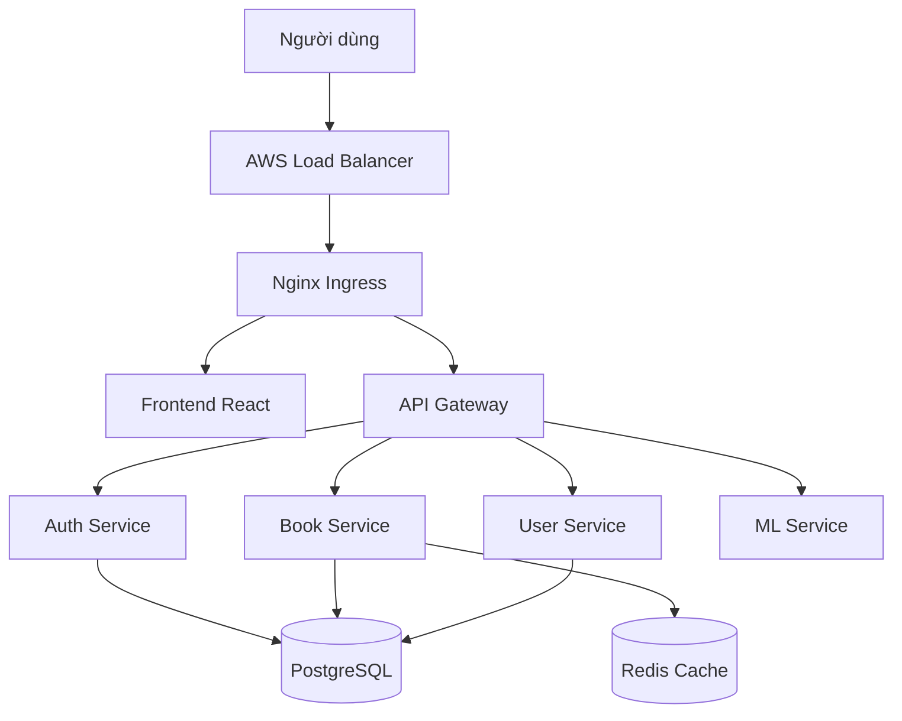

# eShelf - Nền tảng Sách điện tử Doanh nghiệp

[](https://github.com/votrung654/EShelf/actions)
[](https://opensource.org/licenses/MIT)

## Tổng quan Dự án

**eShelf** là nền tảng đọc sách điện tử được xây dựng dựa trên kiến trúc Microservices. Dự án này là sản phẩm tổng hợp phục vụ cho môn học **NT548 - Công nghệ DevOps và Ứng dụng**, thể hiện trọn vẹn vòng đời phát triển phần mềm hiện đại (SDLC) từ khâu cấp phát hạ tầng, tự động hóa cấu hình đến triển khai liên tục theo mô hình GitOps.

**Đơn vị đào tạo:** Trường Đại học Công nghệ Thông tin - ĐHQG TP.HCM
**Môn học:** NT548.Q11 - Công nghệ DevOps và Ứng dụng
**Giảng viên hướng dẫn:** ThS. Lê Anh Tuấn

---

## Kiến trúc Hệ thống

### Thiết kế Kiến trúc
Hệ thống áp dụng kiến trúc Microservices, được triển khai trên nền tảng AWS sử dụng Terraform để quản lý hạ tầng và K3s để điều phối container.


```mermaid
graph TD
    User["Người dùng"] --> ALB["AWS Load Balancer"]
    ALB --> Ingress["Nginx Ingress"]
    Ingress --> Frontend["Frontend React"]
    Ingress --> API["API Gateway"]
    
    API --> Auth["Auth Service"]
    API --> Book["Book Service"]
    API --> UserSvc["User Service"]
    API --> ML["ML Service"]
    
    Auth & Book & UserSvc --> DB[("PostgreSQL")]
    Book --> Redis[("Redis Cache")]
```

### Danh sách Công nghệ (Tech Stack)

| Hạng mục | Công nghệ | Mục đích sử dụng |
|----------|-----------|------------------|
| **Nền tảng Cloud** | AWS | VPC, EC2, Security Groups, IAM, NAT Gateway |
| **Mã hóa Hạ tầng (IaC)** | Terraform | Tự động hóa cấp phát và quản lý trạng thái hạ tầng |
| **Quản lý Cấu hình** | Ansible | Cấu hình máy chủ và cài đặt cụm K3s |
| **Điều phối Container** | K3s | Kubernetes distribution hạng nhẹ cho môi trường Production |
| **CI/CD** | GitHub Actions | Tích hợp liên tục (Lint, Test, Build, Scan, Push) |
| **GitOps** | ArgoCD | Triển khai liên tục và đồng bộ trạng thái Cluster |
| **Giám sát (Monitoring)** | Prometheus, Grafana | Thu thập Metrics và trực quan hóa dữ liệu |
| **Nhật ký (Logging)** | Loki | Thu thập và truy vấn Log tập trung |
| **Bảo mật (DevSecOps)** | Checkov, Trivy, SonarQube | Quét lỗ hổng IaC, Container và mã nguồn |

---

## Phần 1: Thực hành Lab 1 - Hạ tầng Cloud (Cloud Infrastructure)

Bài thực hành tập trung vào việc thiết kế và triển khai hạ tầng mạng và máy chủ trên AWS sử dụng Terraform.

**Vị trí mã nguồn:** `infrastructure/terraform/`

### Phạm vi triển khai
1.  **VPC:** Mạng riêng ảo với dải IP `10.0.0.0/16`.
2.  **Subnets:** Phân chia Public Subnet (cho Bastion, NAT) và Private Subnet (cho K3s Cluster).
3.  **Gateways:** Internet Gateway (IGW) cho kết nối ra ngoài và NAT Gateway cho mạng nội bộ.
4.  **EC2 Instances:**
    *   Bastion Host (Public): Điểm truy cập quản trị (Jump Server).
    *   K3s Master & Worker (Private): Các node vận hành ứng dụng, không có Public IP trực tiếp.
5.  **Security Groups:** Thiết lập tường lửa theo mô hình Zero Trust.

### Hướng dẫn Triển khai
1.  Di chuyển vào thư mục môi trường development:
    ```bash
    cd infrastructure/terraform/environments/dev
    ```
2.  Khởi tạo Terraform (Tải providers và modules):
    ```bash
    terraform init
    ```
3.  Lập kế hoạch thực thi:
    ```bash
    terraform plan -out=tfplan
    ```
4.  Áp dụng cấu hình lên AWS:
    ```bash
    terraform apply tfplan
    ```

### Kiểm tra Kết quả (Verification)
*   **AWS Console:** Kiểm tra VPC, Subnet và danh sách EC2 Instance đã được tạo.
*   **Kết nối SSH:** Kiểm tra khả năng SSH từ máy local vào Bastion, sau đó SSH từ Bastion vào Master Node (IP Private).
*   **Kết nối Internet:** Kiểm tra khả năng truy cập Internet của máy Private thông qua NAT Gateway (lệnh `curl`).

---

## Phần 2: Thực hành Lab 2 - Tự động hóa & CI/CD (Automation)

Bài thực hành mở rộng sang các công cụ tự động hóa quy trình phát triển và vận hành (DevOps Automation).

### 2.1. Terraform & GitHub Actions (Checkov)
Tự động hóa việc triển khai hạ tầng và kiểm tra bảo mật.
*   **Quy trình:** Push code -> Checkov Scan (Security) -> Terraform Plan -> Terraform Apply.
*   **Vị trí:** `.github/workflows/terraform.yml`

### 2.2. CloudFormation & AWS CodePipeline
Sử dụng công cụ native của AWS để triển khai hạ tầng.
*   **Vị trí:** `infrastructure/cloudformation/`
*   **Quy trình:** AWS CodePipeline kích hoạt khi có commit -> AWS CodeBuild kiểm tra template -> AWS CloudFormation triển khai Stack.

### 2.3. Jenkins CI/CD
Xây dựng pipeline truyền thống với Jenkins trên Kubernetes.
*   **Vị trí:** `infrastructure/kubernetes/jenkins/`
*   **Quy trình:** Checkout -> Build Docker -> SonarQube Analysis -> Push to Registry -> Deploy to K8s.

### 2.4. Ansible Configuration (Setup K3s)
Tự động hóa việc cài đặt Kubernetes Cluster trên các EC2 Instance đã tạo ở Lab 1.
*   **Vị trí:** `infrastructure/ansible/`

**Hướng dẫn chạy Ansible:**
1.  Cập nhật file inventory `infrastructure/ansible/inventory/dev.ini` với Private IP của các node.
2.  Chạy Playbook cài đặt:
    ```bash
    cd infrastructure/ansible
    ansible-playbook -i inventory/dev.ini playbooks/setup-cluster.yml
    ```
3.  Kiểm tra trạng thái Cluster trên Master Node:
    ```bash
    kubectl get nodes -o wide
    ```

---

## Phần 3: Đồ án Cuối kỳ - Microservices & GitOps (Final Project)

Đồ án tổng hợp áp dụng kiến trúc Microservices và quy trình GitOps hoàn chỉnh.

### Quy trình Tích hợp Liên tục (CI - GitHub Actions)
File cấu hình: `.github/workflows/ci.yml`
1.  **Linting & Testing:** Kiểm tra cú pháp và chạy unit test cho Backend/Frontend.
2.  **Security Scanning:** Quét lỗ hổng bảo mật với Trivy.
3.  **Build & Push:** Đóng gói Docker Image và đẩy lên Harbor/DockerHub.
4.  **Update Manifest:** Tự động cập nhật thẻ (tag) image mới vào repository chứa cấu hình Kubernetes (`infrastructure/kubernetes`).

### Quy trình Triển khai Liên tục (CD - ArgoCD)
ArgoCD đóng vai trò đồng bộ hóa trạng thái giữa Git (Source of Truth) và Kubernetes Cluster.

**Cài đặt & Cấu hình:**
1.  Cài đặt ArgoCD vào namespace `argocd`:
    ```bash
    kubectl create namespace argocd
    kubectl apply -n argocd -f https://raw.githubusercontent.com/argoproj/argo-cd/stable/manifests/install.yaml
    ```
2.  Truy cập Dashboard (Port-forward):
    ```bash
    kubectl port-forward svc/argocd-server -n argocd 8080:443
    ```
3.  Đăng nhập với tài khoản `admin` và mật khẩu khởi tạo.

---

## Môi trường Phát triển Cục bộ (Local Development)

Dành cho việc phát triển và kiểm thử nhanh không cần hạ tầng AWS.

1.  **Sao chép mã nguồn:**
    ```bash
    git clone https://github.com/votrung654/EShelf.git
    cd EShelf
    ```

2.  **Khởi chạy Backend & Database:**
    ```bash
    cd backend
    docker-compose up -d
    ```

3.  **Khởi chạy Frontend:**
    ```bash
    cd ../frontend
    npm install
    npm run dev
    ```

---

## Kiểm thử và Demo Hệ thống

### Danh sách Endpoints

| Thành phần | URL Cục bộ | URL Production (Ví dụ) |
|------------|------------|------------------------|
| **Frontend** | http://localhost:5173 | http://eshelf.com |
| **API Gateway** | http://localhost:3000 | https://api.eshelf.com |
| **ArgoCD Dashboard** | http://localhost:8080 | https://argocd.eshelf.com |
| **Grafana Dashboard** | - | https://grafana.eshelf.com |

### Tài khoản Demo

*   **Quản trị viên (Admin):** `admin@eshelf.com` / `Admin123!`
*   **Người dùng (User):** `user@eshelf.com` / `User123!`

### Các lệnh kiểm tra (Troubleshooting)

```bash
# Kiểm tra toàn bộ Pods trong Cluster
kubectl get pods -A

# Xem nhật ký hoạt động của service cụ thể
kubectl logs -f -l app=book-service

# Kiểm tra cấu hình Ingress
kubectl get ingress -A
```

---

## Nhóm Thực hiện

| MSSV | Họ và Tên | Vai trò & Trách nhiệm |
|------|-----------|-----------------------|
| 22521571 | **Võ Đình Trung** | Fullstack Development, CI/CD Pipeline, Viết báo cáo |
| 23521809 | **Lê Văn Vũ** | DevOps Engineering, Dựng Video Demo |
| 22521587 | **Trương Phúc Trường** | Cloud Infrastructure, Soạn thảo Slide |

---

© 2026 Nhóm 15 - NT548.Q11. Trường Đại học Công nghệ Thông tin.
