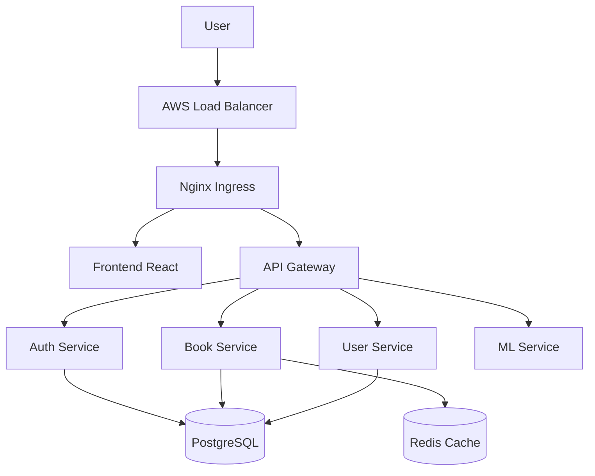

# eShelf - Enterprise eBook Platform

[](https://github.com/votrung654/EShelf/actions)
[](https://opensource.org/licenses/MIT)

## Project Overview

**eShelf** is an enterprise-grade eBook reading platform designed with a microservices architecture. This project serves as a comprehensive demonstration for the **NT548 - DevOps & MLOps** course, showcasing the complete lifecycle of a cloud-native application, from infrastructure provisioning to automated deployment using GitOps principles.

**Institution:** University of Information Technology (UIT)
**Course:** NT548.Q11 - DevOps Technology and Applications
**Instructor:** MSc. Le Anh Tuan

---

## System Architecture

### Architectural Design
The system employs a microservices architecture deployed on AWS using Terraform for infrastructure provisioning and K3s for container orchestration.


```mermaid
graph TD
    User[User] --> ALB[AWS Load Balancer]
    ALB --> Ingress[Nginx Ingress]
    Ingress --> Frontend[Frontend React]
    Ingress --> API[API Gateway]
    
    API --> Auth[Auth Service]
    API --> Book[Book Service]
    API --> UserSvc[User Service]
    API --> ML[ML Service]
    
    Auth & Book & UserSvc --> DB[(PostgreSQL)]
    Book --> Redis[(Redis Cache)]
```

### Technology Stack

| Category | Technology | Usage |
|----------|------------|-------|
| **Cloud Provider** | AWS | VPC, EC2, Security Groups, IAM |
| **Infrastructure as Code** | Terraform | Infrastructure provisioning and state management |
| **Configuration Management** | Ansible | Server configuration and K3s cluster setup |
| **Container Orchestration** | K3s | Lightweight Kubernetes distribution for production |
| **CI/CD** | GitHub Actions | Continuous Integration (Lint, Test, Build, Push) |
| **GitOps** | ArgoCD | Continuous Delivery and Cluster State Synchronization |
| **Monitoring** | Prometheus, Grafana | Metrics collection and visualization |
| **Logging** | Loki | Log aggregation |

---

## Phase 1: Cloud Infrastructure Provisioning

This phase involves provisioning the necessary network and compute resources on AWS using Terraform.

### Prerequisites
- AWS CLI configured with appropriate credentials.
- Terraform (v1.5 or later) installed.
- An S3 Bucket created for storing Terraform State (configured in `main.tf`).

### Deployment Steps

1.  **Navigate to the environment directory:**
    ```bash
    cd infrastructure/terraform/environments/dev
    ```

2.  **Initialize Terraform:**
    Downloads the required providers (AWS) and modules.
    ```bash
    terraform init
    ```

3.  **Generate Execution Plan:**
    Preview the changes that Terraform will make to the infrastructure.
    ```bash
    terraform plan -out=tfplan
    ```

4.  **Apply Configuration:**
    Provision the resources on AWS.
    ```bash
    terraform apply tfplan
    ```

### Verification
Upon successful application, verify the resources in the AWS Console:
- **VPC:** A custom VPC with CIDR `10.0.0.0/16`.
- **EC2 Instances:** Three instances should be running: `Bastion-Host`, `K3s-Master`, and `K3s-Worker`.

---

## Phase 2: Kubernetes Cluster Configuration

This phase transforms the provisioned EC2 instances into a functional Kubernetes cluster using Ansible automation.

### Prerequisites
- Python 3 and Ansible installed (`pip install ansible`).
- SSH access to the Bastion host and private nodes.

### Configuration

1.  **Update Inventory File:**
    Edit `infrastructure/ansible/inventory/dev.ini` with the Private IP addresses obtained from the Terraform output.

    ```ini
    [master]
    <MASTER_PRIVATE_IP> ansible_user=ec2-user

    [worker]
    <WORKER_1_PRIVATE_IP> ansible_user=ec2-user
    <WORKER_2_PRIVATE_IP> ansible_user=ec2-user

    [k3s_cluster:children]
    master
    worker
    ```

2.  **Verify Connectivity:**
    Ensure Ansible can reach all nodes via SSH.
    ```bash
    ansible -i inventory/dev.ini -m ping all
    ```

### Execution

1.  **Run the Cluster Setup Playbook:**
    This playbook installs K3s on the master node and joins the worker nodes to the cluster.
    ```bash
    cd infrastructure/ansible
    ansible-playbook -i inventory/dev.ini playbooks/setup-cluster.yml
    ```

2.  **Verify Cluster Status:**
    SSH into the Master node and check the node status.
    ```bash
    kubectl get nodes -o wide
    ```
    *Expected Result: All nodes should be in the `Ready` status.*

---

## CI/CD and GitOps Implementation

The project utilizes a GitOps approach where the Git repository serves as the single source of truth for both application code and infrastructure configuration.

### Continuous Integration (GitHub Actions)
The CI pipeline is defined in `.github/workflows/ci.yml` and performs the following steps on every push to the `main` branch or Pull Request:
1.  **Linting & Testing:** Static code analysis and unit testing for backend/frontend services.
2.  **Security Scanning:** Vulnerability scanning using Trivy.
3.  **Artifact Build:** Building Docker images for each microservice.
4.  **Registry Push:** Pushing images to the container registry.
5.  **Manifest Update:** Automatically updating the Kubernetes deployment manifests with the new image tag.

### Continuous Delivery (ArgoCD)
ArgoCD is configured to synchronize the `infrastructure/kubernetes` directory with the K3s cluster.

**Setup Instructions:**
1.  **Install ArgoCD:**
    ```bash
    kubectl create namespace argocd
    kubectl apply -n argocd -f https://raw.githubusercontent.com/argoproj/argo-cd/stable/manifests/install.yaml
    ```

2.  **Access the Dashboard:**
    Port-forward the service to access the UI locally:
    ```bash
    kubectl port-forward svc/argocd-server -n argocd 8080:443
    ```

---

## Local Development Environment

For development and testing purposes without AWS infrastructure, Docker Compose can be used.

### Setup

1.  **Clone the Repository:**
    ```bash
    git clone https://github.com/votrung654/EShelf.git
    cd EShelf
    ```

2.  **Start Backend Services:**
    ```bash
    cd backend
    docker-compose up -d
    ```

3.  **Start Frontend Application:**
    ```bash
    cd ../frontend
    npm install
    npm run dev
    ```

---

## System Verification and Access

### Service Endpoints

| Service Component | Local URL | Production URL (Example) |
|-------------------|-----------|--------------------------|
| **Frontend** | http://localhost:5173 | http://eshelf.com |
| **API Gateway** | http://localhost:3000 | https://api.eshelf.com |
| **ArgoCD Dashboard** | http://localhost:8080 | https://argocd.eshelf.com |
| **Grafana Dashboard** | - | https://grafana.eshelf.com |

### Demonstration Credentials

- **Administrator:** `admin@eshelf.com` / `Admin123!`
- **Standard User:** `user@eshelf.com` / `User123!`

### Troubleshooting Commands

```bash
# List all pods in all namespaces
kubectl get pods -A

# Retrieve logs for a specific service
kubectl logs -f -l app=book-service

# Check Ingress configuration
kubectl get ingress -A
```

---

## Project Team

| Student ID | Name | Role & Responsibilities |
|------------|------|-------------------------|
| 22521571 | **Vo Dinh Trung** | Fullstack Development, CI/CD Pipeline, Report |
| 23521809 | **Le Van Vu** | DevOps Engineering, Demo Video Production |
| 22521587 | **Truong Phuc Truong** | Cloud Infrastructure, Presentation Materials |

---

© 2026 Group 15 - NT548.Q11. University of Information Technology.
