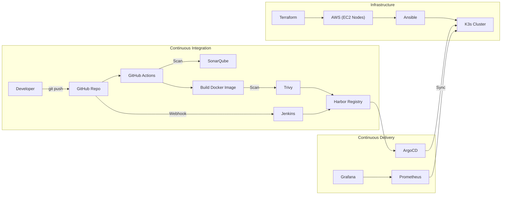

# EShelf - Enterprise E-book Platform

[](https://github.com/votrung654/EShelf/actions)
[](https://opensource.org/licenses/MIT)

## Project Overview

**EShelf** is an e-book reading platform built on a Microservices architecture. This project serves as a comprehensive final product for the **NT548 - DevOps Technology and Application** course, demonstrating the complete modern Software Development Life Cycle (SDLC) from infrastructure provisioning and automated configuration to continuous deployment using the GitOps model.

**Institution:** University of Information Technology - VNU-HCM
**Course:** NT548.Q11 - DevOps Technology and Application
**Instructor:** MSc. Le Anh Tuan

---

## System Architecture

### Architectural Design
The system utilizes a Microservices architecture, deployed on the AWS platform, using Terraform for infrastructure management and K3s for container orchestration.


```mermaid
graph TD
    User["User"] --> ALB["AWS Load Balancer"]
    ALB --> Ingress["Nginx Ingress"]
    Ingress --> Frontend["React Frontend"]
    Ingress --> API["API Gateway"]
    
    API --> Auth["Auth Service"]
    API --> Book["Book Service"]
    API --> UserSvc["User Service"]
    API --> ML["ML Service"]
    
    Auth & Book & UserSvc --> DB[("PostgreSQL")]
    Book --> Redis[("Redis Cache")]
```

### DevOps Architecture & CI/CD Pipeline
An automated workflow extending from development to infrastructure and application deployment.


```mermaid
graph LR
    subgraph Infrastructure
        Terraform --> AWS["AWS (EC2 Nodes)"]
        AWS --> Ansible
        Ansible --> K3s["K3s Cluster"]
    end

    subgraph CI["Continuous Integration"]
        Dev["Developer"] -->|git push| GH["GitHub Repo"]
        GH --> GHA["GitHub Actions"]
        GH -->|Webhook| Jenkins["Jenkins"]
        
        GHA -->|Scan| Sonar["SonarQube"]
        GHA --> Build["Build Docker Image"]
        Build -->|Scan| Trivy
        Trivy --> Harbor["Harbor Registry"]
        Jenkins --> Harbor
    end

    subgraph CD["Continuous Delivery"]
        Harbor --> ArgoCD
        ArgoCD -->|Sync| K3s
        Prometheus --> K3s
        Grafana --> Prometheus
    end
```

### Technology Stack

| Category | Technology | Purpose |
|----------|-----------|------------------|
| **Cloud Platform** | AWS | VPC, EC2, Security Groups, IAM, NAT Gateway |
| **Infrastructure as Code (IaC)** | Terraform | Automated provisioning and infrastructure state management |
| **Configuration Management** | Ansible | Server configuration and K3s cluster installation |
| **Container Orchestration** | K3s | Lightweight Kubernetes distribution for Production |
| **CI/CD** | GitHub Actions | Continuous Integration (Lint, Test, Build, Scan, Push) |
| **GitOps** | ArgoCD | Continuous Delivery and Cluster state synchronization |
| **Monitoring** | Prometheus, Grafana | Metrics collection and data visualization |
| **Logging** | Loki | Centralized log aggregation and querying |
| **Security (DevSecOps)** | Checkov, Trivy, SonarQube | Scanning IaC, Container vulnerabilities, and Source Code |

---

## Part 1: Lab 1 - Cloud Infrastructure

This section focuses on designing and deploying network and server infrastructure on AWS using Terraform.

**Source Code Location:** `infrastructure/terraform/`

### Deployment Scope
1.  **VPC:** Virtual Private Cloud with a `10.0.0.0/16` IP range.
2.  **Subnets:** Separated Public Subnets (for Bastion, NAT) and Private Subnets (for K3s Cluster).
3.  **Gateways:** Internet Gateway (IGW) for external connectivity and NAT Gateway for internal network routing.
4.  **EC2 Instances:**
    *   Bastion Host (Public): Jump server for administrative access.
    *   K3s Master & Worker (Private): Application execution nodes, no direct Public IPs.
5.  **Security Groups:** Firewall configuration adhering to the Zero Trust model.

### Deployment Instructions
1.  Navigate to the development environment directory:
    ```bash
    cd infrastructure/terraform/environments/dev
    ```
2.  Initialize Terraform (Download providers and modules):
    ```bash
    terraform init
    ```
3.  Generate an execution plan:
    ```bash
    terraform plan -out=tfplan
    ```
4.  Apply the configuration to AWS:
    ```bash
    terraform apply tfplan
    ```

### Verification
*   **AWS Console:** Verify the creation of the VPC, Subnets, and EC2 Instances.
*   **SSH Connection:** Test SSH access from local machine to Bastion, then from Bastion to a Master Node (Private IP).
*   **Internet Connectivity:** Use `curl` to verify Internet access from a Private instance via NAT Gateway.

---

## Part 2: Lab 2 - Automation & CI/CD

This phase introduces automation tools for software development and operational workflows (DevOps Automation).

### 2.1. Terraform & GitHub Actions (Checkov)
Automates infrastructure deployment and security validation.
*   **Workflow:** Push code -> Checkov Scan (Security) -> Terraform Plan -> Terraform Apply.
*   **Location:** `.github/workflows/terraform.yml`

### 2.2. CloudFormation & AWS CodePipeline
Utilizes native AWS tooling for infrastructure deployment.
*   **Location:** `infrastructure/cloudformation/`
*   **Workflow:** AWS CodePipeline triggers on commit -> AWS CodeBuild tests template -> AWS CloudFormation deploys Stack.

### 2.3. Jenkins CI/CD
Establishes a traditional pipeline using Jenkins distributed on Kubernetes.
*   **Location:** `infrastructure/kubernetes/jenkins/`
*   **Workflow:** Checkout -> Build Docker -> SonarQube Analysis -> Push to Registry -> Deploy to K8s.

### 2.4. Ansible Configuration (Setup K3s)
Automates internal Kubernetes Cluster installation on the provisioned Lab 1 EC2 Instances.
*   **Location:** `infrastructure/ansible/`

**Running Ansible:**
1.  Target your node Private IPs in the inventory file `infrastructure/ansible/inventory/dev.ini`.
2.  Execute the installation Playbook:
    ```bash
    cd infrastructure/ansible
    ansible-playbook -i inventory/dev.ini playbooks/setup-cluster.yml
    ```
3.  Verify Cluster status on the Master Node:
    ```bash
    kubectl get nodes -o wide
    ```

---

## Part 3: Final Project - Microservices & GitOps

The capstone project applies a complete Microservices architecture alongside native GitOps workflows.

### Continuous Integration (CI - GitHub Actions)
Configuration file: `.github/workflows/ci.yml`
1.  **Linting & Testing:** Syntax checks and backend/frontend unit tests.
2.  **Security Scanning:** Vulnerability scans leveraging Trivy.
3.  **Build & Push:** Containerizing Docker Images and storing in Harbor/DockerHub.
4.  **Update Manifest:** Automatic updates of the newest image tags in the Kubernetes config repository (`infrastructure/kubernetes`).

### Continuous Delivery (CD - ArgoCD)
ArgoCD acts as a synchronizer managing states between Git (Source of Truth) and the local Kubernetes Cluster.

**Installation & Configuration:**
1.  Install ArgoCD in the `argocd` namespace:
    ```bash
    kubectl create namespace argocd
    kubectl apply -n argocd -f https://raw.githubusercontent.com/argoproj/argo-cd/stable/manifests/install.yaml
    ```
2.  Access Dashboard via Port-forward:
    ```bash
    kubectl port-forward svc/argocd-server -n argocd 8080:443
    ```
3.  Log in using the `admin` account and auto-generated password.

---

## Local Development Environment

Intended for rapid development and testing without the necessity of AWS infrastructure.

1.  **Clone Source Code:**
   ```bash
   git clone https://github.com/votrung654/EShelf.git
   cd EShelf
   ```

2.  **Start Backend & Database Services:**
   ```bash
   cd backend
   docker-compose up -d
   ```
   
3.  **Start Frontend:**
   ```bash
   cd ../frontend
   npm install
   npm run dev
   ```

---

## System Testing & Demos

### List of Endpoints

| Component | Local URL | Production URL (Example) |
|------------|------------|------------------------|
| **Frontend** | http://localhost:5173 | http://eshelf.com |
| **API Gateway** | http://localhost:3000 | https://api.eshelf.com |
| **ArgoCD Dashboard** | http://localhost:8080 | https://argocd.eshelf.com |
| **Grafana Dashboard** | - | https://grafana.eshelf.com |

### Demo Accounts

*   **Administrator (Admin):** `admin@eshelf.com` / `Admin123!`
*   **Standard User (User):** `user@eshelf.com` / `User123!`

### Troubleshooting Commands

```bash
# Check all Pods inside the Cluster
kubectl get pods -A

# Check runtime logs of a specific service
kubectl logs -f -l app=book-service

# Check Ingress configuration status
kubectl get ingress -A
```

---

## Technical Team (Group 15)

| Student ID | Full Name | Roles & Responsibilities |
|------|-----------|-----------------------|
| 22521571 | **Vo Dinh Trung** | DevOps Engineering, CI/CD Pipeline, Reporting |
| 23521809 | **Le Van Vu** | Fullstack Development, Presentation Slides |
| 22521587 | **Truong Phuc Truong** | Cloud Infrastructure, Video Demo Production|

---

© 2026 Group 15 - NT548.Q11. University of Information Technology.
